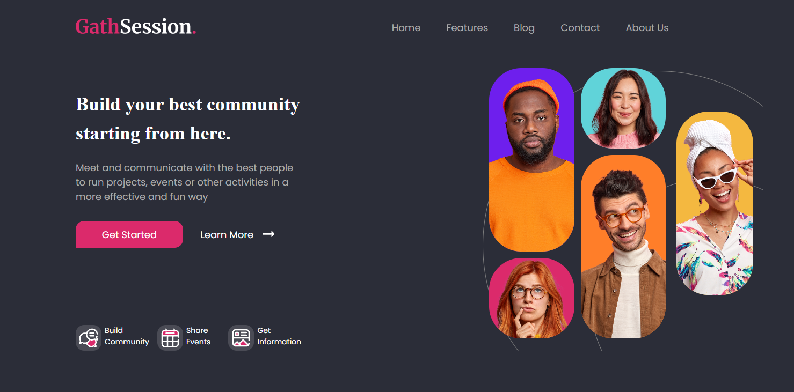

<p align="right">
  <a href="./README.md">🇺🇸 English</a> | 🇪🇸 Español
</p>

<h1 align="center"> Header Gathsession</h1>

<p align="center">
Proyecto frontend desarrollado como implementación de una sección header-hero utilizando herramientas modernas de desarrollo frontend y buenas prácticas.
</p>

<p align="center">
Construido con HTML, SCSS, JavaScript y Vite
</p>

<p align="center">

<a href="https://edgarmadrid.github.io/Header_Gathsession/">

</a>

</p>

---

<p align="center">


</p>

---

## 🔗 Demo

<p align="center">
<a href="https://edgarmadrid.github.io/Header_Gathsession/">
Ver demo en vivo →
</a>
</p>

---

## ✨ Sobre el proyecto

**Header Gathsession** es un proyecto frontend enfocado en construir una sección moderna de header-hero basada en un diseño de Figma, siguiendo prácticas reales de desarrollo profesional.

Este proyecto fue desarrollado utilizando **Vite** como herramienta de construcción y aplicando una arquitectura modular basada en **componentes**.

### Conceptos aplicados:

✅ Arquitectura basada en componentes  
✅ Estructura semántica en HTML  
✅ SCSS para estilos escalables  
✅ JavaScript para interactividad y estructura  
✅ Metodología BEM para nomenclatura de clases  
✅ Diseño responsive  
✅ Fidelidad pixel-perfect al diseño  
✅ Uso de recursos SVG  
✅ Estados hover e interactividad  

---

## 🎯 Objetivo

Recrear una sección header-hero de alta fidelidad a partir de un diseño en Figma, aplicando prácticas profesionales de frontend utilizadas en proyectos reales.

### Enfoque:

- Arquitectura limpia basada en componentes  
- Estructura SCSS mantenible  
- CSS reutilizable con BEM  
- Interfaz responsive  
- HTML semántico correcto  
- Configuración de proyecto con Vite  

---

## 🚀 Tecnologías

<div align="center">

| Tecnología | Uso |
|-----------|------|
| 🌐 HTML5 | Estructura |
| 🎨 SCSS | Estilos |
| ⚡ JavaScript | Interactividad |
| ⚡ Vite | Entorno de desarrollo / bundler |

</div>

---

## 📷 Vista previa

<p align="center">

</p>

---

## 🛠️ Ejecutar localmente

Clonar el repositorio:

```bash
git clone https://github.com/EdgarMadrid/Header_Gathsession.git
```

Entrar al proyecto:

```bash
cd Header_Gathsession
```

Instalar dependencias:

```bash
pnpm install
```

Ejecutar entorno de desarrollo:

```bash
pnpm run dev
```

Construir el proyecto:

```bash
pnpm run build
```

---

## 📚 Aprendizajes

Este proyecto reforzó conocimientos en:

- Arquitectura frontend basada en componentes  
- Organización y escalabilidad con SCSS  
- Integración de JavaScript en componentes UI  
- Flujo de trabajo con Vite  
- Metodología BEM  
- Sistemas de diseño responsive  
- Buenas prácticas de HTML semántico  

---

## 👨‍💻 Autor

<p align="center">

<a href="https://github.com/EdgarMadrid">

</a>

<a href="https://www.linkedin.com/in/emadrid110">

</a>

</p>

---

<p align="center">
⭐ Si te gustó este proyecto puedes darle una estrella en GitHub
</p>
